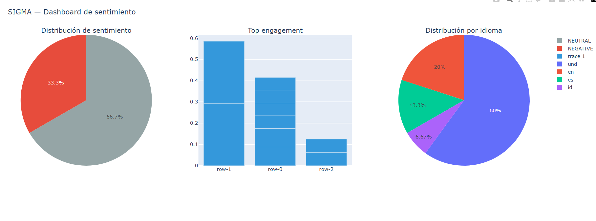
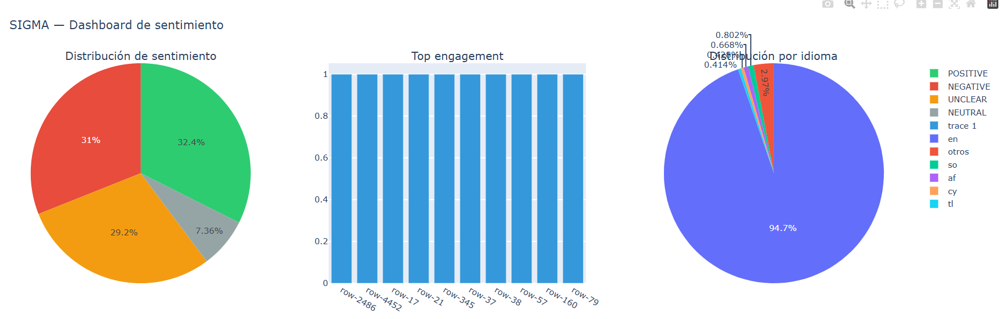
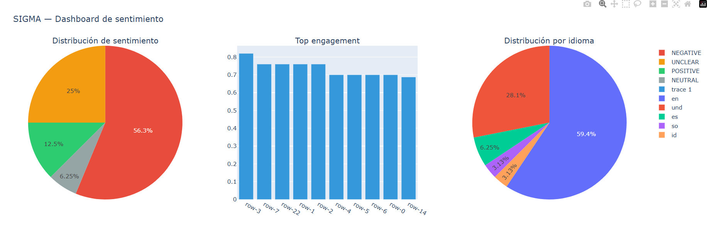

# SIGMA — Sistema Integrado para la Gestión Multiagente


[](https://orcid.org/0009-0003-4849-3369)

> **SIGMA no es una respuesta. Es el sistema que aprende a responder.**

🇬🇧 [English version available here](README.md)

---

SIGMA es un ecosistema de agentes autónomos de código abierto para
analizar, diseñar, calcular y decidir, construido mediante una
metodología de desarrollo asistido por IA (*vibecoding*) y documentado
desde su arquitectura hasta la resolución de incidentes reales en
producción.

Múltiples agentes especializados colaboran bajo una arquitectura de
orquestación central triangular — Director/Engineer/Auditor, tres
orquestadores (ver ADR-016) — para abordar proyectos de Ingeniería de
Datos, Ciencia de Datos, Análisis de Datos, Ingeniería General, Física,
Matemáticas y Axiometría.

## ✅ Verificado localmente

```
El pipeline completo del Hito 1 corrió de principio a fin contra
infraestructura Docker real y el dataset real de Tirendaz (27,481 tweets):
0000-system-health-check   → success
0001-data-ingestion        → success
0002-data-cleanser         → success
0003-data-preprocessor     → success_with_warnings
0008-sentiment-analyzer    → success
0011-viz-reporter          → success
✓✓ Pipeline completado con éxito
```

Suite de pruebas completa:
```
================================ 65 passed, 36 warnings in 20.80s ================================
```

> **Nota sobre la cobertura de pruebas:** los 65 tests incluyen tanto
> pruebas unitarias completamente aisladas (con conectores simulados
> para PostgreSQL/Redis) como pruebas de integración contra
> infraestructura real. La evidencia más sólida de corrección
> end-to-end no es el conteo de tests en sí, sino la corrida completa
> del pipeline contra infraestructura Docker real que se muestra arriba
> (`warnings=[]`, los 6 skills con `status=success`).

**El Hito 2, Rollout 1 (orquestación jerárquica, ADR-016) está
completo** — verificado contra las 4 condiciones de salida: suite
pytest-bdd completa en verde (65/65, incluyendo
`0004-statistical-validator`), 4+ corridas reales consecutivas sin
fallo, circuit breaker verificado con un fallo no recuperable forzado
(cero reintentos, fail rápido confirmado), y traza Langfuse completa
verificada de extremo a extremo (trace padre + eventos hijo,
confirmado directamente contra la base de datos). Ver
[docs/adr/adr-016-orquestacion-jerarquica.md](docs/adr/adr-016-orquestacion-jerarquica.md)
para el plan completo de Rollouts.

### 📊 Ejemplos de dashboard en vivo

Los siguientes dashboards fueron generados por el pipeline real de
SIGMA (`0011-viz-reporter`), no simulados ni construidos a mano:

**Tirendaz — corrida post-reestructuración** (línea base, `warnings=[]`)


**Reseñas de IMDb — prueba cross-dominio** (texto largo, `warnings=[]`)


**Social Media 2026 — prueba cross-dominio** (activó correctamente el gate de calidad HITL)


Dashboards interactivos completos: [`outputs/`](outputs/) (descarga y
abre localmente — GitHub muestra el HTML crudo, no la página renderizada).


## ✨ Características

- 🧠 **Memoria epistémica** — Feature Store temporal + Grafo de Suposiciones que separa hechos verificados de hipótesis refutables ([ADR-001](docs/adr/adr-001-memoria-epistemica.md))
- 🔒 **Contención epistémica K ⊆ X** — ningún agente puede afirmar algo que no rastree a un dato observado ([ADR-008](docs/adr/adr-008-restriccion-epistemica.md))
- 🛡️ **Seguridad automatizada Red/Blue/Green** — pruebas adversariales previas al vuelo, monitoreo de AgBOM en tiempo real, y recuperación auditada ([ADR-003](docs/adr/adr-003-equipo-3-colores.md))
- ✅ **Aprobación humana vía Vibe Diff** — cadena de custodia persistente en MinIO antes de cualquier acción de impacto medio o alto ([ADR-004](docs/adr/adr-004-vibe-diff-mfa.md))
- 📊 **Evaluación de 7 dimensiones** — intención, corrección, costo, calidad de código, trayectoria y auto-reparación, no solo "los tests pasan" ([ADR-007](docs/adr/adr-007-evaluacion-multidimensional.md))
- 🔍 **Trazabilidad completa en Langfuse V2** — cada decisión, cada llamada a herramienta, con degradación elegante si Langfuse falla ([ADR-011](docs/adr/adr-011-trazabilidad-langfuse.md))
- 🐳 **100% autoalojable en su variante gratuita** — SIGMA-FE corre enteramente en tu propia máquina, sin dependencia de servicios de pago
- 🔀 **4 niveles de costo** — desde SIGMA-FE ($0) hasta SIGMA-HE (alto rendimiento), cada uno operable en submodo Dev o Runtime
- 🌳 **Orquestación jerárquica** — un Director coordina Engineers especializados (Datos, Modelos, Auditor), construidos por Rollouts verificados, no todos a la vez ([ADR-016](docs/adr/adr-016-orquestacion-jerarquica.md))

## ❌ Lo que SIGMA NO hace

- No elimina las alucinaciones por completo — las contiene
  estructuralmente (K ⊆ X) y hace que las violaciones sean detectables,
  no imposibles.
- No reemplaza la validación humana para acciones de impacto
  medio/alto — la exige (Vibe Diff + HITL).
- No garantiza la precisión del output del LLM — garantiza la
  trazabilidad de cada afirmación hasta un dato observado.
- Todavía no funciona automáticamente sobre cualquier dataset — el
  pipeline del Hito 1 está verificado contra datos de sentimiento de la
  familia Tirendaz; la generalización más amplia se está probando
  activamente (ver abajo).

## Por qué SIGMA es diferente

La mayoría de los proyectos de agentes construyen primero
funcionalidad vistosa y añaden gobernanza después, si acaso. SIGMA se
construyó al revés, deliberadamente: la memoria epistémica, la
seguridad automatizada, la gestión de secretos, y la contención de
alucinaciones (`K ⊆ X`) existían **antes** de que hubiera un solo
dashboard que mostrar. Cada decisión arquitectónica está respaldada por
un Architecture Decision Record (ADR) explícito — 23 hasta la fecha,
todos formalmente aceptados — no por convención tácita.

## Niveles de costo

SIGMA se adapta a cuatro niveles de presupuesto sobre el mismo stack
arquitectónico:

| Variante | Costo | Para quién |
|---|---|---|
| **SIGMA-FE** (Full Engineer) | $0 | Ingeniería propia, stack 100% autoalojado |
| **SIGMA-LE** (Low-Cost Engineer) | Bajo | Servicios esenciales ya construidos |
| **SIGMA-ME** (Medium-Cost Engineer) | ~50% de pago | Equipos con presupuesto moderado |
| **SIGMA-HE** (High-Cost Engineer) | Alto | Empresas que requieren alto rendimiento |

Cada variante puede además operar en submodo **Dev** (depuración) o
**Runtime** (producción con datos reales) — un eje completamente
independiente del costo, ej. `--variant SIGMA-FE --submode Dev`. Detalle
completo en [SIGMA_v2.4.md](docs/SIGMA_v2.4.md), la carta de fundación
del ecosistema (`SIGMA_v1.7.md` está archivado en `docs/Docs_hito1/`
como registro histórico del Hito 1).

## Prerrequisitos

- Docker y Docker Compose
- Python 3.12+
- [Ngrok](https://ngrok.com/download) — expone el webhook HITL local a
  Zulip durante el desarrollo (no es un paquete Python, se instala y
  corre por separado)
- Cuenta de Kaggle con token de API (formato KGAT) — para descargar el
  dataset de entrenamiento

## Primeros pasos

```bash
git clone https://github.com/PensadorZ/SIGMA.git
cd SIGMA
cp .env.example .env
# Edita .env con tus valores reales
docker compose up -d

# Prueba rápida — datos sintéticos generados internamente, sin
# dependencia de infraestructura real, iteración rápida:
python director_main.py --variant SIGMA-FE --submode Dev --data-path ./data/tirendaz.csv

# Corrida completa — dataset real de Tirendaz (27,481 tweets etiquetados)
# contra infraestructura Docker real (PostgreSQL, Redis, MinIO, Langfuse):
python director_main.py --variant SIGMA-FE --submode Runtime --data-path ./data/tirendaz.csv
```

### 🩹 Si el pipeline no corre — solución de problemas de Docker

El bloqueo más común no es el código, es que Docker no está levantado.
Antes que nada:

```bash
# 1. Asegúrate de que la aplicación Docker Desktop esté abierta y
#    totalmente iniciada (su ícono en la bandeja deja de animarse
#    cuando el motor está listo).

# 2. Revisa qué contenedores existen y su estado:
docker ps -a

# 3. Si aparecen como "Exited" (postgres, langfuse_db, redis, minio,
#    langfuse), inícialos directamente -- no los recrees:
docker start sigma_postgres sigma_langfuse_db sigma_redis sigma_minio sigma_langfuse

# 4. Confirma que los 5 estén "Up (healthy)" -- dale 10-15 segundos,
#    especialmente a Postgres y Langfuse:
docker ps

# 5. Solo si los contenedores no existen en absoluto (clon nuevo, o
#    Docker Desktop reinstalado), recréalos:
docker compose up -d
```

Guía completa paso a paso en [ESTRUCTURA_PROYECTO.md](docs/ESTRUCTURA_PROYECTO.md).

## Documentación

| Documento | Qué encontrarás ahí |
|---|---|
| [SIGMA_v2.4.md](docs/SIGMA_v2.4.md) | Carta de Fundación — arquitectura, variantes, roadmap, alineación de gobernanza |
| [AGENTS_CREATOR.md](docs/AGENTS_CREATOR.md) | Carta fundacional — el contrato que todo agente sigue |
| [docs/adr/](docs/adr/) | 23 Architecture Decision Records — ver [adr-README.md](docs/adr/adr-README.md) para el índice completo |
| [TROUBLESHOOTING.md](docs/TROUBLESHOOTING.md) | Incidentes reales encontrados durante el Hito 1 y su resolución exacta |
| [TROUBLESHOOTING_HITO2.md](docs/TROUBLESHOOTING_HITO2.md) | Incidentes reales encontrados desde el Hito 2 en adelante |


## 🏗️ Arquitectura

```
sigma-hito2/
├── director_main.py         # Punto de entrada -- reemplaza a orchestrator.py (Hito 1, archivado)
├── webhook_receiver.py      # Recibe respuestas HITL de Zulip
├── sigma/                   # Paquete Python instalable
│   ├── core/                # Config, conexiones, tracing, checkpointer, state,
│   │                         director.py, engineer_datos.py, skill_runner.py
│   ├── hooks/                # Notificaciones de Zulip
│   └── skills/                # Los 7 skills de Engineer Datos, cada uno con:
│       └── 000X-nombre/        SKILL.md, skill.py, defaults.yaml,
│                                references/, evals/, tests/
├── db/                      # Esquema de PostgreSQL (7 tablas)
├── docs/
│   ├── SIGMA_v2.4.md         # El documento fundacional del Arnés
│   ├── AGENTS_CREATOR.md    # Contrato de gobernanza de agentes
│   └── adr/                  # 23 Architecture Decision Records
└── tests/                   # Suite compartida (65/65 pasando)
```

Ver [ESTRUCTURA_PROYECTO.md](docs/ESTRUCTURA_PROYECTO.md) para el árbol
completo y el detalle carpeta por carpeta.

## ⚠️ Limitaciones conocidas

Con la misma disciplina de gobernanza que define a SIGMA, aquí están
los vacíos reales del estado actual — sin maquillaje:

- **`INSTALL.md` y `PIPELINES.md` todavía no existen.** La guía de
  instalación paso a paso vive por ahora en
  [ESTRUCTURA_PROYECTO.md](docs/ESTRUCTURA_PROYECTO.md).
- **Ngrok requiere arranque manual en dos terminales.** El flujo HITL
  vía Zulip necesita `uvicorn` + `ngrok` corriendo antes de lanzar el
  pipeline — todavía sin automatización de arranque. Gracias al Dev
  Domain gratuito de Ngrok (desde enero de 2026), la URL se mantiene
  fija entre reinicios, pero el arranque en sí sigue siendo manual.
- **Sin CI configurado.** Los 65/65 tests se verifican localmente;
  todavía no hay un workflow de GitHub Actions que corra la suite en
  cada push.
- **Bug de auto-reporte de `duration_ms` en dos skills, mitigado, no
  resuelto de raíz.** `0003-data-preprocessor` y `0011-viz-reporter`
  auto-reportan `0ms` sin importar el tiempo real transcurrido;
  `skill_runner.py` ahora mide el tiempo real de forma independiente y
  ya no confía en el valor auto-reportado, así que esto no afecta la
  corrección — pero el bug subyacente dentro de esos dos skills
  todavía no se ha diagnosticado.
- **El bot de Zulip solo reacciona a mensajes directos, nunca a
  mensajes de canal/tema** — este es el comportamiento propio de la
  plataforma de Zulip (los webhooks salientes se disparan
  exclusivamente por DM o @-mención), no una limitación de SIGMA. Ver
  `TROUBLESHOOTING.md`, Incidente 4. Además, una vez que se configura
  la URL del webhook de un bot, **Zulip no permite editarla desde la
  UI** — crear un bot nuevo es la única forma de apuntar a un endpoint
  distinto.
- **La cuenta del bot de Zulip se desactiva intermitentemente** — causa
  raíz sin diagnosticar todavía; el pipeline no falla por esto
  (degradación elegante ya verificada, ADR-011), pero las
  notificaciones no llegan mientras la cuenta está inactiva.

Ninguno de estos vacíos bloquea el uso del pipeline tal como está
documentado.

## Estado del proyecto

Hito 1 completo: un pipeline de 6 skills corriendo de principio a fin
contra datos reales, con 65/65 tests automatizados pasando. El output
del pipeline vive en MinIO — el producto terminado debe buscarse en el
dashboard generado ahí.

**Hito 2 — Rollout 1 completo** (Director + Engineer Datos,
`0000-0004, 0008, 0011`, ADR-016): arquitectura jerárquica de tres
orquestadores (Director/Engineer Datos/Engineer Modelos/Engineer
Auditor), construida en fases verificadas. Las 4 condiciones de salida
cumplidas — suite de tests completa en verde, múltiples corridas reales
consecutivas, circuit breaker verificado con un fallo forzado, y
trazabilidad Langfuse confirmada de extremo a extremo. Esquema de
variantes de costo migrado a `SIGMA-FE/LE/ME/HE` + submodo
`Dev/Runtime` independiente en todo el código de Rollout 1.

Siguen Rollout 2 (Engineer Modelos: `0005-0007, 0009-0010`) y Rollout 3
(Engineer Auditor: `0012-0015`, gateado por el sandboxing de ADR-017).

## Licencia

[MIT](LICENSE)

---

<p align="center">
Hecho con 🧠 y gobernanza disciplinada por
<a href="https://orcid.org/0009-0003-4849-3369">Prof. Marx Agustín García Delgado</a>
</p>
