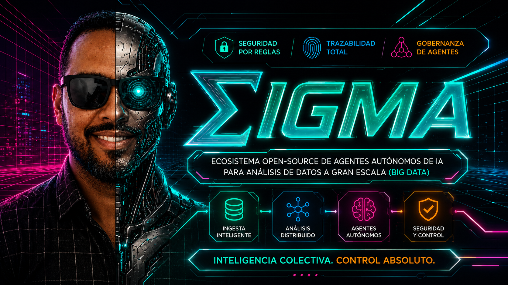

# SIGMA — Integrated System for Multi-Agent Management




[](https://orcid.org/0009-0003-4849-3369)

> **SIGMA is not an answer. It's the system that learns to answer.**

🇪🇸 [Versión en español disponible aquí](README.es.md)

---

SIGMA is an open-source autonomous agent ecosystem for analyzing,
designing, calculating, and deciding, built through an AI-assisted
development methodology (*vibecoding*) and documented from its
architecture down to real production incident resolution.

Multiple specialized agents collaborate under a triangular central
orchestration architecture — Director/Auditor/Engineer, three
orchestrators (see ADR-016) — to tackle projects in Data Engineering,
Data Science, Data Analysis, General Engineering, Physics, Mathematics,
and Axiometrics.

## ✅ Verified locally

```
Milestone 1's full pipeline ran end to end against real Docker
infrastructure and the real Tirendaz dataset (27,481 tweets):
0000-system-health-check   → success
0001-data-ingestion        → success
0002-data-cleanser         → success
0003-data-preprocessor     → success_with_warnings
0008-sentiment-analyzer    → success
0011-viz-reporter          → success
✓✓ Pipeline completed successfully
```

Full test suite: 
```
================================ 65 passed, 36 warnings in 20.80s ================================
```

> **Note on test coverage:** the 65 tests include both fully isolated
> unit tests (using simulated connectors for PostgreSQL/Redis) and
> integration tests against real infrastructure. The strongest evidence
> of end-to-end correctness isn't the test count itself, but the full
> pipeline run against real Docker infrastructure shown above
> (`warnings=[]`, all 6 skills `status=success`).

### 📊 Live dashboard examples

The following dashboards were generated by SIGMA's real pipeline
(`0011-viz-reporter`), not simulated or hand-crafted. Since GitHub
doesn't render raw HTML files inline, use these preview links to see
them fully rendered:

- [✅ Tirendaz — post-restructuring run](https://htmlpreview.github.io/?https://raw.githubusercontent.com/PensadorZ/SIGMA/main/outputs/dashboard_run4_ok.html) — baseline, `warnings=[]`
- [✅ IMDb reviews — cross-domain test](https://htmlpreview.github.io/?https://raw.githubusercontent.com/PensadorZ/SIGMA/main/outputs/dashboard_run5_imdb_ok.html) — long-form text, `warnings=[]`
- [✅ Social Media 2026 — cross-domain test](https://htmlpreview.github.io/?https://raw.githubusercontent.com/PensadorZ/SIGMA/main/outputs/dashboard_run6_social_ok_warnings.html) — triggered the HITL quality gate correctly

Full methodology and findings: [`output_report.md`](outputs/output_report.en.md)


## ✨ Features

- 🧠 **Epistemic memory** — temporal Feature Store + Assumption Graph separating verified facts from refutable hypotheses ([ADR-001](docs/adr/adr-001-memoria-epistemica.en.md))
- 🔒 **Epistemic containment K ⊆ X** — no agent can assert anything that doesn't trace back to an observed data point ([ADR-008](docs/adr/adr-008-restriccion-epistemica.en.md))
- 🛡️ **Automated Red/Blue/Green security** — pre-flight adversarial testing, real-time AgBOM monitoring, and audited recovery ([ADR-003](docs/adr/adr-003-equipo-3-colores.en.md))
- ✅ **Human approval via Vibe Diff** — persistent chain of custody in MinIO before any medium- or high-impact action ([ADR-004](docs/adr/adr-004-vibe-diff-mfa.en.md))
- 📊 **7-dimension evaluation** — intent, correctness, cost, code quality, trajectory, and self-repair, not just "tests pass" ([ADR-007](docs/adr/adr-007-evaluacion-multidimensional.en.md))
- 🔍 **Full traceability in Langfuse V2** — every decision, every tool call, with graceful degradation if Langfuse goes down ([ADR-011](docs/adr/adr-011-trazabilidad-langfuse.en.md))
- 🐳 **100% self-hostable in its free variant** — SIGMA-FE runs entirely on your own machine, with no paid service dependency
- 🔀 **4 cost tiers** — from SIGMA-FE ($0) to SIGMA-HE (high performance), each operable in Dev or Runtime submode

## ❌ What SIGMA does NOT do

- Does not eliminate hallucinations completely — it contains them
  structurally (K ⊆ X) and makes violations detectable, not impossible.
- Does not replace human validation for medium/high-impact actions —
  it enforces it (Vibe Diff + HITL).
- Does not guarantee LLM output accuracy — it guarantees traceability
  of every claim back to an observed data point.
- Does not yet work automatically on any dataset — Milestone 1's
  pipeline is verified against Tirendaz-family sentiment data; broader
  generalization is being actively tested (see below).

## Why SIGMA is different

Most agent projects build flashy functionality first and add governance
later, if at all. SIGMA was built backwards, deliberately: epistemic
memory, automated security, secrets management, and hallucination
containment (`K ⊆ X`) existed **before** there was a single dashboard to
show. Every architectural decision is backed by an explicit Architecture
Decision Record (ADR) — 16 to date — not tacit convention.

## Cost tiers

SIGMA adapts to four budget levels on the same architectural stack:

| Variant | Cost | For whom |
|---|---|---|
| **SIGMA-FE** (Full Engineer) | $0 | Own engineering, 100% self-hosted stack |
| **SIGMA-LE** (Low-Cost Engineer) | Low | Essential pre-built services |
| **SIGMA-ME** (Medium-Cost Engineer) | ~50% paid | Teams with moderate budget |
| **SIGMA-HE** (High-Cost Engineer) | High | Enterprises requiring high performance |

Each variant can additionally operate in **Dev** (debugging) or
**Runtime** (production with real data) submode. Full detail in
[SIGMA_v1.7.md](docs/SIGMA_v1.7.md).

## Prerequisites

- Docker and Docker Compose
- Python 3.12+
- [Ngrok](https://ngrok.com/download) — exposes the local HITL webhook to
  Zulip during development (not a Python package, installed and run
  separately)
- Kaggle account with an API token (KGAT format) — to download the
  training dataset

## Getting started

```bash
git clone https://github.com/PensadorZ/SIGMA.git
cd SIGMA
cp .env.example .env
# Edit .env with your real values
docker compose up -d

# Quick test — synthetic data generated internally, no real
# infrastructure dependency, fast iteration:
python orchestrator.py --variant Dev --data-path ./data/tirendaz.csv

# Full run — real Tirendaz dataset (27,481 labeled tweets) against
# real Docker infrastructure (PostgreSQL, Redis, MinIO, Langfuse):
python orchestrator.py --variant Full --data-path ./data/tirendaz.csv
```

Full step-by-step guide in [ESTRUCTURA_PROYECTO.md](docs/ESTRUCTURA_PROYECTO.en.md).

## Documentation

| Document | What you'll find there |
|---|---|
| [SIGMA_v1.7.md](docs/SIGMA_v1.7.md) | Full Master Plan — architecture, variants, roadmap |
| [AGENTS_CREATOR.md](docs/AGENTS_CREATOR.md) | Founding charter — the contract every agent follows |
| [docs/adr/](docs/adr/) | 16 Architecture Decision Records |
| [TROUBLESHOOTING.md](docs/TROUBLESHOOTING.md) | Real incidents found and their exact resolution |


## 🏗️ Architectur

```
sigma-hito1/
├── orchestrator.py          # LangGraph graph, pipeline entry point
├── webhook_receiver.py      # Receives HITL responses from Zulip
├── sigma/                   # Installable Python package
│   ├── core/                # Config, connections, tracing, checkpointer, state
│   ├── hooks/                # Zulip notifications
│   └── skills/                # Milestone 1's 6 skills, each with:
│       └── 000X-name/          SKILL.md, skill.py, defaults.yaml,
│                                references/, evals/, tests/
├── db/                      # PostgreSQL schema (7 tables)
├── docs/
│   ├── SIGMA_v1.7.md         # The Harness's founding document
│   ├── AGENTS_CREATOR.md    # Agent governance contract
│   └── adr/                  # 16 Architecture Decision Records
└── tests/                   # Shared suite (65/65 passing)
```

See [ESTRUCTURA_PROYECTO.md](docs/ESTRUCTURA_PROYECTO.en.md) for the
full tree and folder-by-folder detail.

## ⚠️ Known limitations

With the same governance discipline that defines SIGMA, here are the
real gaps in the current state — no gloss:

- **The CLI still uses the previous variant scheme.**
  `orchestrator.py --variant {Full,Lite,Dev,Runtime}` is still what's
  live; migrating to the documented scheme (`SIGMA-FE/LE/ME/HE` +
  `--submode`) was deliberately postponed to Milestone 2 to avoid
  risking Milestone 1's verified 65-test suite.
- **`INSTALL.md` and `PIPELINES.md` don't exist yet.** The step-by-step
  install guide currently lives in
  [ESTRUCTURA_PROYECTO.md](docs/ESTRUCTURA_PROYECTO.en.md).
- **Ngrok requires manual startup across two terminals.** The HITL flow
  via Zulip needs `uvicorn` + `ngrok` running before launching the
  pipeline — no startup automation yet. Thanks to Ngrok's free Dev
  Domain (since January 2026), the URL stays fixed across restarts, but
  the startup itself is still manual.
- **No CI configured.** The 65/65 tests are verified locally; there's
  no GitHub Actions workflow running the suite on every push yet.
- **`0011`'s dashboard verification — completed.** The most recent Full
  run confirmed a fixed sentiment palette, correctly grouped languages,
  and zero warnings (`warnings=[]`). One minor open question remains:
  the "Top engagement" axis shows generic row identifiers (`row-0`,
  `row-1`) instead of a more descriptive value — to be confirmed
  whether this is the final design or a pending adjustment.
- **The Zulip bot only reacts to direct messages, never to
  channel/topic messages** — this is Zulip's own platform behavior
  (Outgoing webhooks fire exclusively on DM or @-mention), not a SIGMA
  limitation. See `TROUBLESHOOTING.md`, Incident 4. Additionally, once
  a bot's webhook URL is set, **Zulip doesn't allow editing it from the
  UI** — creating a new bot is the only way to point to a different
  endpoint.
- **Zulip bot account intermittently deactivated** — root cause not
  yet diagnosed; the pipeline doesn't fail because of this (graceful
  degradation already verified, ADR-011), but notifications don't
  arrive while the account is inactive.

None of these gaps block using Milestone 1 as documented — they're
honestly the ground left for Milestone 2.

## Project status

Milestone 1 (Hito 1) complete: a 6-skill pipeline running end to end
against real data, with 65/65 automated tests passing. Milestone 2 in
design: three-level hierarchical orchestration (Director/Engineer).

## License

[MIT](LICENSE)

---

<p align="center">
Made with 🧠 and disciplined governance by
<a href="https://orcid.org/0009-0003-4849-3369">Prof. Marx Agustín García Delgado</a>
</p>
